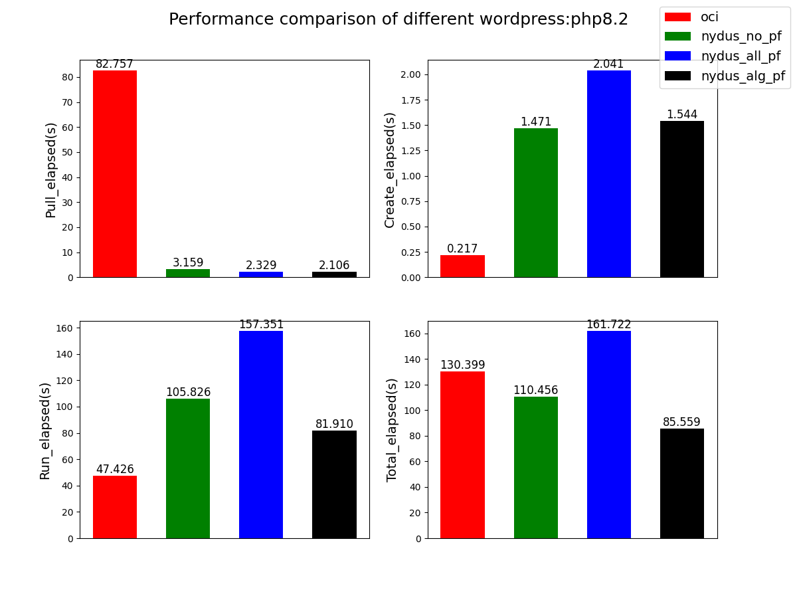

# Prefetch Acceleration
Work on:
nydus-snapshotter commit 2ee4efdbef
nydusd, nydus-image, nydusctl, nydusify commit c202e918d4

we have some hack changes:
* prefetch_begin info : 
```rs
// in image-service/rafs/src/fs.rs:176 in pub fn import() of Rafs
  info!(
      "prefetch_begin:{}",
      SystemTime::now()
          .duration_since(UNIX_EPOCH)
          .unwrap()
          .as_micros()
  );
```
* ino info: 
```rs
// in image-service/rafs/src/fs.rs:672 in pub fn read() of Rafs
  let latency = start.unwrap().elapsed().unwrap().as_micros();
  log::info!(
      "metrics: {} {} {} {} {}",
      ino,
      offset,
      size,
      latency,
      SystemTime::now()
          .duration_since(UNIX_EPOCH)
          .unwrap()
          .as_micros()
  );
```
* nydus-snapshotter config: 
```golang
// in image-service/config/daemonconfig/fuse.go:31 in type FuseDaemonConfig struct {
  AmplifyIo       int `json:"amplify_io"`
```

And you'd better to set the default fuse threads as 1, in src/bin/nydusd/main.rs:115

## Getting started
Please ensure your `nerdctl` is beyond v0.22 and set the containerd environment for nydus.
Before use this tool we should clear local images and containers.
Please run this tool in root

### Run main.py
```shell
# workdir /path/to
./main.py
```

#### result:
| timestamp     | registry                     | repo                               | pull_elapsed(s) | create_elapsed(s) | run_elapsed(s) | total_elapsed(s) |
|---------------|------------------------------|------------------------------------|-----------------|-------------------|----------------|------------------|
| 1679452971386 | dockerhub.kubekey.local/dfns | wordpress:php8.2                   | 82.756568       | 0.217260          | 47.425543      | 130.399371       |
| 1679453082471 | dockerhub.kubekey.local/dfns | wordpress:php8.2_nydus             | 3.158560        | 1.471396          | 105.826356     | 110.456312       |
| 1679453245585 | dockerhub.kubekey.local/dfns | wordpress:php8.2_nydus_prefetchall | 2.328988        | 2.041426          | 157.351379     | 161.721793       |
| 1679453332195 | dockerhub.kubekey.local/dfns | wordpress:php8.2_nydus_prefetch    | 2.105628        | 1.543616          | 81.909640      | 85.558884        |



four benchs for image,the first is oci bech,the second is the nydus without prefetch bench, the third is nydus witch prefech all bench, the latest is nydus prefetch with algorithm bench
### Run convert.py and metrics.py

```shell
# workdir /path/to/metrics
# collect metrics (optional use -t 10 to controll the metrics times default once)
python3 metrics.py --config config.yaml
# conver dockerhub image to nydus format 
python3 convert.py --config config.yaml
# you can also use the run.sh
```

This is a example of the config.yaml for metrics.py
```yaml
# the registry of the images
registry: dockerhub.kubekey.local/dfns
# we will use the --insecure-registry if this is True
insecure_registry: True
# the image list which includes the name(:tag) and the arg(option, such as -e  -v) 
images:
 - name: mysql:nydus 
   arg: -e MYSQL_ROOT_PASSWD=123456
 - name: node:nydus
```
### Run bench.py
Please ensure your `nerdctl` is beyond v0.22 and have containerd environment for nydus
```shell
# To run benchmark for nydus snapshotter.
# workdir /path/to/bench
./bench.py --snapshotter nydus --registry=dockerhub.kubekey.local/dfns --insecure-registry --images alpine:nydus
```
## Description
